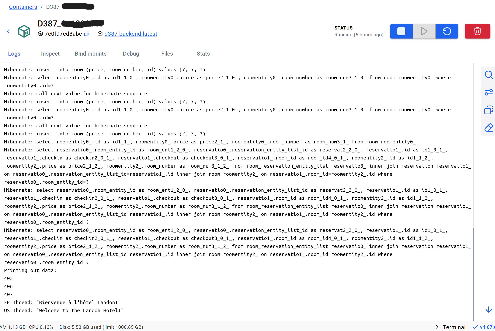
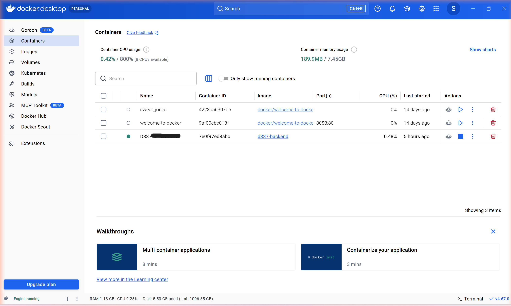

# D387 – Advanced Java Multithreaded Application

## Overview
This project was completed for WGU's D387 - Advanced Java course, demonstrating the ability to build and modify a full‑stack application using Java/Spring Boot backend** and Angular frontend. 
Starting from an existing full-stack application (Java/Spring Boot backend, Angular front end), this project adds concurrent backend processing, real-time currency conversion, and prepares the application for containerized cloud deployment. The project focused on applying Java's concurrency utilities correctly in a real request/response flow, integrating an external API, and packaging the application with Docker for deployment to AWS.


## Features
### ✔ Multithreaded Language Translation
- Uses Java multithreading to translate a message into multiple languages concurrently.
- Each translation runs in its own thread.
- Results are combined and returned to the Angular frontend.

### ✔ Time Zone Messaging
- Generates a message showing the current time in multiple time zones (e.g., EST, PST, UTC).
- Uses Java’s `ZonedDateTime` and `ZoneId` classes.
- Returned to the frontend via REST API.

### ✔ Currency Exchange
- Pulls live exchange rates from an external API.
- Converts a user‑provided amount between currencies.
- Uses Java HTTP client + JSON parsing.

### ✔ Angular Frontend
- Displays translation results, time‑zone messages, and currency conversions.
- Communicates with the Spring Boot backend via REST endpoints.
- Built and served as part of the full‑stack application.

### ✔ Docker Containerization
- Spring Boot backend packaged as an executable JAR.
- Dockerfile builds a single image containing the backend.
- Container runs the multithreaded application on a specified port.


## Tech Stack

- Java 17  
- Spring Boot  
- Angular  
- TypeScript  
- HTML/CSS  
- REST API integration
- Docker

## Docker Containerization

This project uses Docker to package and run the full multithreaded Spring Boot + Angular application. The Angular front end is bundled automatically into the Spring Boot JAR during the Maven build process.

### Step 1 — Build the Application JAR

```bash
mvn clean package
```

This produces a runnable JAR inside `target/`.

### Step 2 — Create the Dockerfile

Place this Dockerfile in the project root:

```dockerfile
FROM eclipse-temurin:17-jdk-alpine
WORKDIR /app
COPY target/D387-advanced-java-0.0.2-SNAPSHOT.jar app.jar
EXPOSE 8080
ENTRYPOINT ["java", "-jar", "app.jar"]
```

This Dockerfile:
- Uses a lightweight Java runtime
- Copies the packaged JAR
- Exposes port 8080
- Runs the application automatically

### Step 3 — Build the Docker Image

```bash
docker build -t d387-backend .
```

### Step 4 — Run the Docker Container

```bash
docker run -p 8080:8080 d387-backend
```


**Application running in a Docker container**, with multithreaded translation output visible in the logs:



**Container running in Docker Desktop:**




## Cloud Deployment Plan

This assignment also called for documenting how the containerized application would be deployed to the cloud.
**AWS** was selected as the target platform for its scalable container orchestration and monitoring tools, which integrate well with Dockerized Java applications.

**1. Access AWS ECS**
Sign in to the AWS Management Console and create a new ECS cluster using the "Networking only" template. Configure the VPC, subnets, and security groups, ensuring port 8080 is open for the Spring Boot backend.

**2. Package the Application**
Build the Docker image locally and verify it runs successfully (see Docker Containerization above).

**3. Push to a Registry**
Push the verified image to a container registry — Amazon Elastic Container Registry (ECR) or Docker Hub — by creating a repository and pushing the tagged image.

**4. Deploy to ECS**
Create an ECS task definition referencing the image, specifying CPU, memory, and network settings. Run the task for initial testing, then create an ECS Service for continuous operation.

**5. Monitor and Scale**
Enable Amazon CloudWatch Logs to capture application output, and configure Auto Scaling to adjust running tasks based on CPU or memory utilization. Updates would follow the same pattern: rebuild the image, push to the registry, and update the ECS task definition to redeploy.


